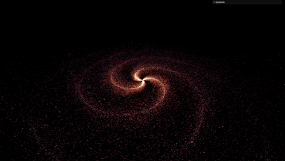

# 🧠 Focus and Concentration: Galactic Journey 🌌



> **Your Cosmic Focus Companion**  
> Boost your productivity with a stunning 3D galaxy visual + 40Hz Gamma Binaural Beats 🎧

---

## ✨ Overview

Welcome to **Focus and Concentration: Galactic Journey** — a calming, immersive web app designed to sharpen your focus, enhance concentration, and create the perfect digital space for productivity. Whether you're working, studying, meditating, or just need a mental reset, this app is your peaceful galaxy away from distractions.

🪐 **Live Demo**: [focus-and-concentration.vercel.app](https://focus-and-concentration.vercel.app)  
🌌 **Project Link**: [GitHub Repository](https://github.com/ULTRASIRI/Focus-and-Concentration)

---

## 🎯 Features: Explore and Concentrate

### 🌌 Dynamic 3D Galaxy
- Beautiful, ever-moving space scene powered by **Three.js**
- Mesmerizing but non-distracting visual to help you stay in the zone

### ⚙️ Customize Your Cosmos
Adjust everything about your galaxy in real-time using the **lil-gui** control panel:

- **Stars**: Change count and size  
- **Galaxy Shape**: Set radius, branches (spiral arms), and spin  
- **Randomness**: Add natural variation  
- **Colors**: Choose insideColor and outsideColor  
- **Movement**: Control rotationSpeed  

### 🎧 40Hz Gamma Binaural Beats
Scientifically linked to **enhanced cognition and focus**, these beats run in the background as you explore your galaxy. Headphones recommended for the best experience.

### 🎚️ Easy Audio Controls
- **Play / Pause** music  
- **Volume slider** for ideal background intensity

### 🖱️ Simple 3D Navigation
- **Rotate**: Click and drag  
- **Pan**: Right-click + drag  
- **Zoom**: Use your scroll wheel  

### 📱 Fully Responsive Design
Looks stunning on any screen—mobile, tablet, or desktop.

---

## 🚀 Getting Started

### 🔧 Prerequisites
All you need is a **modern browser** (Chrome, Firefox, Edge, Safari).

---

### 📥 Installation

```bash
git clone https://github.com/ULTRASIRI/Focus-and-Concentration.git
cd Focus-and-Concentration

📁 Important: Place your galaxy.mp3 file in the main project directory, next to index.html.
```
---


### ▶️ Run the App
```
Open the index.html file in your browser

Use the GUI panel (top-left) to customize your galaxy

Use audio controls to play/pause background music

Explore using your mouse:

Rotate: Click + drag

Pan: Right-click + drag

Zoom: Scroll wheel
```

---

### 💻 Technologies Used
```
| Technology                                                                    | Description                                     |
| ----------------------------------------------------------------------------- | ----------------------------------------------- |
| [Three.js](https://threejs.org/)                                              | JavaScript library for rendering 3D graphics    |
| [OrbitControls](https://threejs.org/docs/#examples/en/controls/OrbitControls) | 3D camera interaction module                    |
| [lil-gui](https://lil-gui.georgealways.com/)                                  | Lightweight GUI library for live control panels |
| HTML5, CSS3, JavaScript                                                       | Core web technologies                           |
```
---

### 💡 Suggestions & Issues

#### Have a cool idea or found a bug? We’d love your input!

Create a New Issue
Tag it as enhancement or bug

You can also contribute ideas through Discussions or Pull Requests.ggestions & Issues

---

## 📬 Contact
Created by @ULTRASIRI
Feel free to reach out with questions or suggestions.

📫  Email : ceo.shriinath@gmail.com
🧑🏻‍💻  LinkedIN : www.linkedin.com/in/shrinath-hinge
